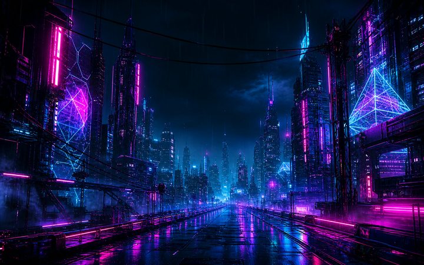

# Neon Overdrive for Omarchy



Neon Overdrive is a magenta-and-cyan Omarchy theme with animated Hyprland
transitions, translucent shell surfaces, a matching lock screen, an optional
Cava spectrum, and an animated `mpvpaper` city that pulses with your music.

The standard Omarchy theme files live at the repository root, so a repository
named `omarchy-neon-overdrive-theme` installs with the slug `neon-overdrive`.
The installer changes only user-owned paths and never writes to
`/usr/share/omarchy`.

## Requirements

- Omarchy 4.0 or newer (tested with 4.0.0)
- Hyprland and the Omarchy Quickshell shell
- `cava` with PipeWire support for the spectrum widget
- `mpvpaper` for the animated desktop
- `setpriv`, `flock`, `jq`, `luac`, Bash, and standard Omarchy commands
- a running Omarchy desktop session for the full extras installer

`cava` is in the Arch repositories. `mpvpaper` is normally installed from the
AUR. The installer checks both and offers to install them through the Omarchy
package commands.

## Install

For the full reactive theme, clone the repository and run its installer:

```bash
git clone git@github.com:0xsl0th/omarchy-neon-overdrive-theme.git
cd omarchy-neon-overdrive-theme
./install.sh
```

You can also run `./install.sh` from any checkout. In that case it copies the
curated theme files into the user theme directory before applying them.

Useful modes:

```bash
./install.sh --check
./install.sh --install-deps
./install.sh --migrate-legacy
./install.sh --no-start
```

If you used the early `sloth.cava` prototype or direct `mpvpaper` autostart,
pass `--migrate-legacy`. The installer stashes those launchers under its
recovery state directory, preserves the bar position and settings, and
replaces them with the packaged pair so only one Cava analyzer and wallpaper
process run. Uninstall restores the stashed launchers without discarding later
autostart edits.

The full installer:

1. validates the repository and checks dependencies;
2. makes timestamped backups under the user's XDG state directory;
3. installs and enables `neon-overdrive.cava` in the center bar section;
4. installs the silent 12-second video and its music-reactive launcher;
5. adds one clearly marked block to `~/.config/hypr/autostart.lua`;
6. applies `neon-overdrive` with `omarchy theme set`;
7. disables `omarchy.background` only after the live wallpaper control socket
   is ready, so `--no-start` keeps the current background until next login; and
8. reloads and checks Hyprland when a session is available.

For the static theme only, use `omarchy theme install` and do not run
`install.sh`.

## Music reactivity

One PipeWire-backed Cava process drives the 18-band bar at 30 fps. The same
service groups the spectrum into bass, mids, and highs, detects beat transients,
and sends a subtle brightness/saturation/contrast pulse to the existing
wallpaper over mpv's local Unix socket at roughly 6 Hz. It adds no second audio
capture process or fullscreen render layer. Grades return to neutral after
silence and during normal plugin reload, disable, or shutdown.

The bar widget settings expose spectrum width, idle visibility, bar glow,
wallpaper reactivity, and wallpaper intensity. Set **React on the wallpaper**
off to keep the spectrum while leaving the video unchanged.

If the widget shows its crossed-audio status, hover it for the Cava error. The
most common cause is an unavailable PipeWire session; this command runs the
same capture configuration directly:

```bash
cava -p ~/.config/omarchy/plugins/neon-overdrive.cava/cava.conf
```

## Uninstall

```bash
./uninstall.sh
```

The uninstaller stops only the managed wallpaper process, disables and stashes
only the managed plugin, removes only the marked Hyprland block, restores the
previous background-plugin state, and switches back to the recorded previous
theme when it is still available. Removed files are retained in a timestamped
recovery backup. A Git-managed theme checkout is preserved.

## Validation

```bash
./validate.sh
```

Validation is repository-only: it does not apply the theme, reload Hyprland, or
touch live configuration.

## Assets and provenance

The city artwork was generated with OpenAI image generation and the original
PNG retains its signed C2PA manifest. Derived previews, poster, lock image, and
video are documented with SHA-256 checksums in [ASSETS.md](ASSETS.md). Those
derived files may not retain the embedded C2PA manifest, so keep the original
source and checksum file with any copy of the theme.
